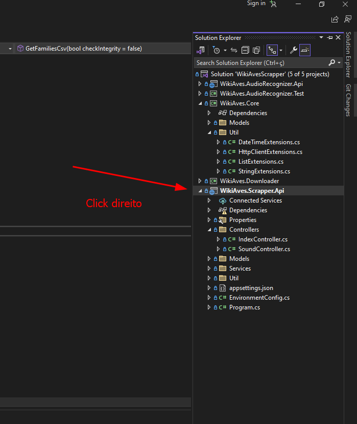
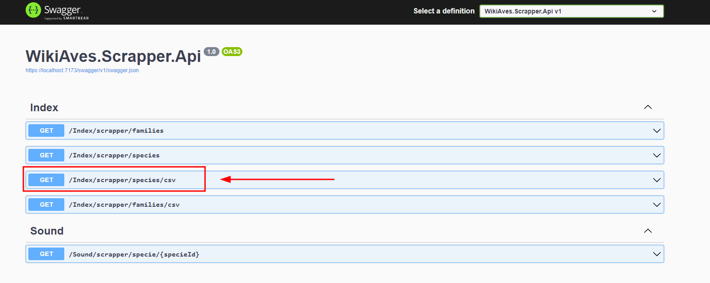
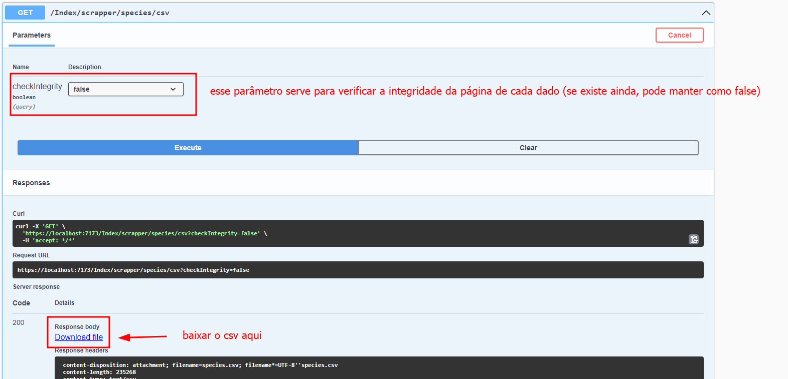

Baixe e instale o Visual Studio Community 2022
Link: https://visualstudio.microsoft.com/pt-br/thank-you-downloading-visual-studio/?sku=Community&channel=Release&version=VS2022&source=VSLandingPage&passive=false&cid=2030

Baixe o .NET Framework 6.0
Link: https://dotnet.microsoft.com/pt-br/download/dotnet/thank-you/sdk-6.0.420-windows-x64-installer

Após instalar ambos, abre o arquivo "WikiAvesScrapper.sln", irá abrir uma instância do VS Community

Defina o projeto de instalação o "WikiAves.Scrapper.API", exemplo na imagem abaixo:

Explorador de Soluções -> click direito no WikiAves.Scrapper.API -> Definir projeto como inicializador/startup

Após isso, iniciar o projeto como "https", desta forma a API estará executando para realizar os testes integrados posteriormente

Depois de iniciar a API, um swagger irá abrir, você deve executar a rota "index/scrapper/species/csv"

Após isso, baixe o CSV para visualizar as informações.

OBS: Os dados de raspagem são pegos do site https://www.wikiaves.com.br